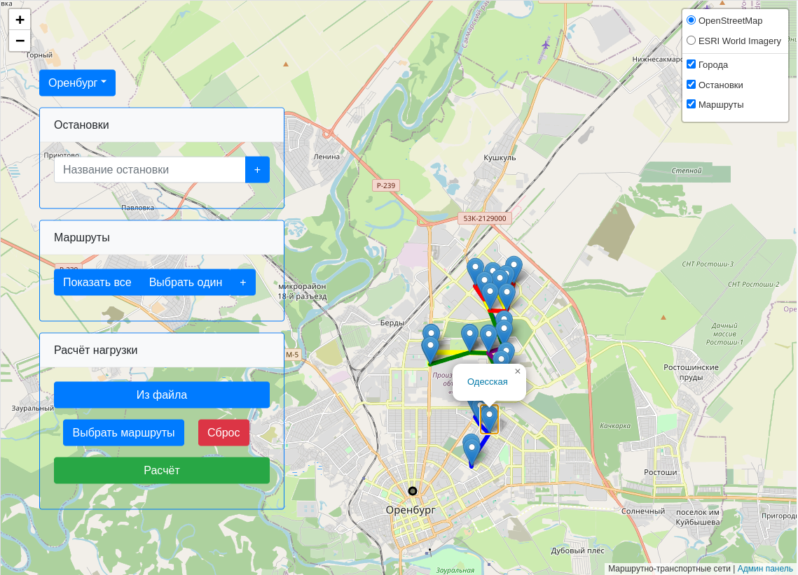
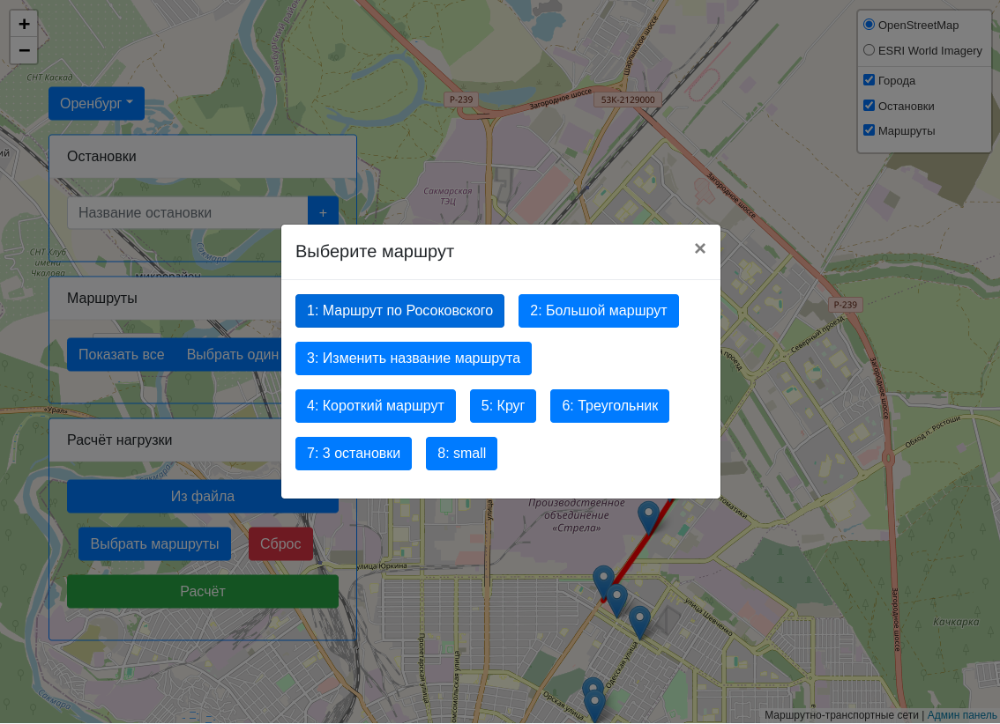

# OptiMoVe: Оптимизация движения
Дипломная работа: Моделирование движения городского пассажирского транспорта

### Полное техническое задание представлено в каталоге `info` в файле `Дипломная работа.docx`

### Используемые технологии при создании программного средства:
* Язык программирования: `Python`
* `Django`
* `JavaScript`
* `JQuery`
* `Bootstrap`

### Экранные формы программного средства представлены ниже

>**Основное окно авторизованного пользователя**
>
>**Модальное окно выбора маршрута**
>*Данные получены по средствам ajax запросов*
>

### Инструкция развёртывания

python 3.10.6
все зависимости находятся в файле req.txt

**Установка:**

***Docker***

-Установить на машину Docker

-Открыть в терминале папку web_map

-Прописать команду: docker compose -f "docker-compose.yml" up -d --build

*Результат:*

>✔ Network web_map_default Created
>
>✔Container web_map-web-1 Started

-Перейти на http://127.0.0.1:8000/

*Остановка:* **Осторожно, останавливает и удаляет другие контейнеры!**

>\$ docker stop $(docker ps -all -q)
>
>\$ docker rm $(docker ps -all -q)

***Без Docker***

-Установить python

-Сделать виртуальное окружение и активировать его

-Установить зависимости с помощью команды: pip install -r req.txt

-Запустить тестовый сервер: python manage.py runserver

-Перейти на http://127.0.0.1:8000/

<!-- TODO

Реализовать сжатие на стороне nginx т.к. будут передаваться большие данные в методе load_calculation

настройка:

Откройте конфигурационный файл Nginx (обычно nginx.conf) для редактирования.
Включите Gzip сжатие, добавив или убедившись в наличии следующих директив в http блоке:
http {
    ...
    gzip on;
    gzip_types text/plain application/xml application/json application/javascript text/css;
    gzip_proxied any;
    ...
}

sudo systemctl reload nginx -->
