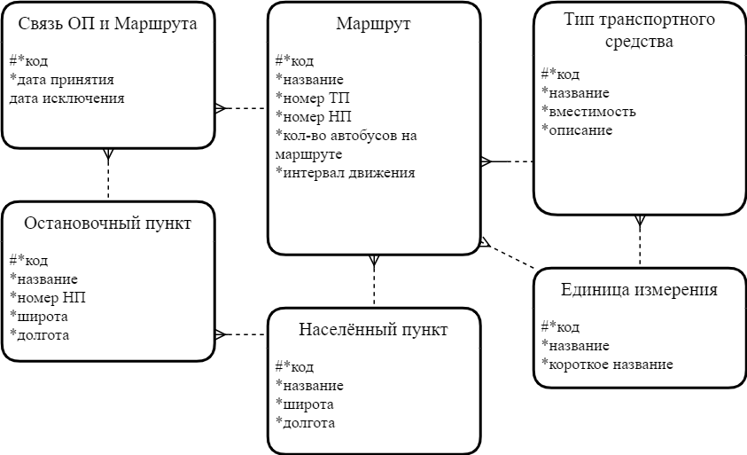

# OptiMoVe: Оптимизация движения
Дипломная работа: Моделирование движения городского пассажирского транспорта

### Полное техническое задание представлено в каталоге `info` в файле `Дипломная работа.docx`

### Используемые технологии при создании программного средства:
* Язык программирования: `Python`
* `Django`
* `JavaScript`
* `JQuery`
* `Bootstrap`

### Экранные формы программного средства представлены ниже

>**Основное окно авторизированного пользователя**
>
>**Модальное окно выбора маршрута**
>*Данные получены по средствам ajax запросов*
>

### Структура базы данных по методологии Ричарда Баркера 

### Инструкция развёртывания

python 3.10.6
все зависимости находяться в файле req.txt

**Установка:**

***Docker***

-Установить на машину Docker

-Открыть в терминале папку web_map

-Прописать команду: docker compose -f "docker-compose.yml" up -d --build

*Результат:*

>✔ Network web_map_default  Created
>✔ Container web_map-web-1  Started

-Перейти на http://127.0.0.1:8000/

*Остановка:* **Осторожно, останавливает и удаляет другие контейнеры!**

>\$ docker stop \$(docker ps -all -q)
>\$docker rm \$(docker ps -all -q)

***Без Docker***

-Установить python

-Сделвть виртуальное окружение и активировать его

-Установить зависимости с помощью команды: pip install -r req.txt

-Запустить тестовый сервер: python manage.py runserver

-Перейти на http://127.0.0.1:8000/
